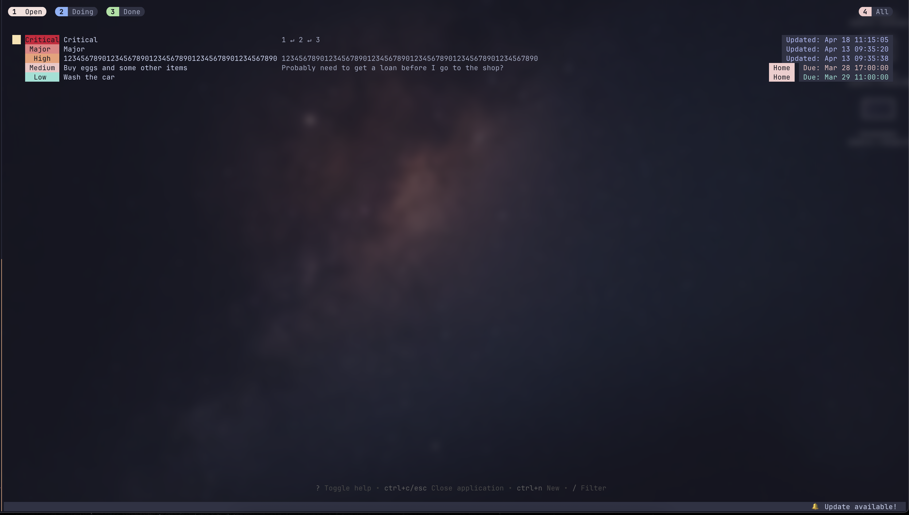
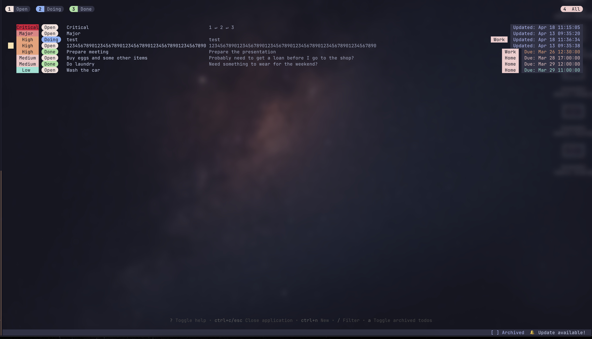
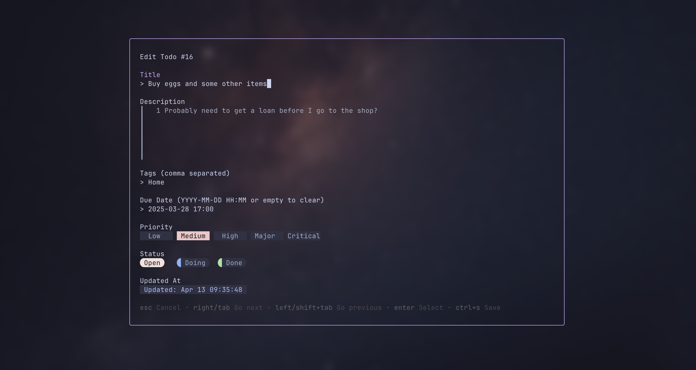

# Todo TUI

A powerful, terminal-based todo application built with Go. Manage your tasks efficiently without leaving the command line.

[](https://golang.org/)
[](https://github.com/martijnspitter/tui-todo/releases/latest)
[](LICENSE)



## Table of Contents

- [Features](#features)
- [Requirements](#requirements)
- [Installation](#installation)
  - [macOS and Linux](#macos-and-linux)
  - [Windows](#windows)
- [Keyboard Shortcuts](#keyboard-shortcuts)
  - [Navigation](#navigation)
  - [Task Management](#task-management)
  - [Views and Filtering](#views-and-filtering)
  - [Application](#application)
- [Configuration](#configuration)
- [Screenshots](#screenshots)
- [Development](#development)
  - [Building from Source](#building-from-source)
  - [Running Tests](#running-tests)
  - [Development Setup](#development-setup)
- [Collaboration](#collaboration)
  - [Development Workflow](#development-workflow)
  - [Pull Request Guidelines](#pull-request-guidelines)
  - [Code Style](#code-style)
  - [Issue Reporting](#issue-reporting)
- [Support and Community](#support-and-community)
- [Troubleshooting](#troubleshooting)
- [License](#license)

## Features

- 📋 Simple and intuitive terminal UI
- 🏷️ Tag support for organizing related tasks
- 🔄 Multiple status views (Open, Doing, Done, Archived)
- 🚩 Priority levels (Low, Medium, High)
- 📅 Due date support
- 🔍 Filtering and searching capabilities
- ⌨️ Keyboard-driven interface

## Requirements

- Terminal with support for TUI applications

## Installation

### macOS and Linux

```bash
# Download the appropriate version for your system
curl -L -o tui-todo.tar.gz https://github.com/martijnspitter/tui-todo/releases/latest/download/tui-todo-$(uname -s | tr '[:upper:]' '[:lower:]')-$(uname -m).tar.gz

# Extract
tar -xzf tui-todo.tar.gz

# Run installer
./install.sh

# Clean up
rm tui-todo.tar.gz todo install.sh

# Now you can use the app from anywhere
todo
```

### Windows

1. Download the [latest Windows release](https://github.com/martijnspitter/tui-todo/releases/latest/download/tui-todo-windows-amd64.zip)
2. Extract the ZIP file
3. Right-click on `install.ps1` and select "Run with PowerShell"
4. Open a new PowerShell window and run `todo`

## Keyboard Shortcuts

### Navigation

| Key              | Action              |
| ---------------- | ------------------- |
| Tab / Right      | Next field/item     |
| Shift+Tab / Left | Previous field/item |
| Up / k           | Move up             |
| Down / j         | Move down           |
| g / Home         | Go to first item    |
| G / End          | Go to last item     |
| Enter            | Select/Confirm      |
| Esc              | Go back/Cancel      |

### Task Management

| Key    | Action                 |
| ------ | ---------------------- |
| Ctrl+N | Create new todo        |
| Ctrl+E | Edit selected todo     |
| Ctrl+D | Delete selected todo   |
| Ctrl+S | Advance todo status    |
| Ctrl+A | Archive/Unarchive todo |

### Views and Filtering

| Key | Action                      |
| --- | --------------------------- |
| 1   | Switch to Open todos        |
| 2   | Switch to Doing todos       |
| 3   | Switch to Done todos        |
| 4   | Switch to Archived todos    |
| a   | Toggle archived todos       |
| /   | Filter by title/description |
| t   | Filter by tag               |

### Application

| Key    | Action             |
| ------ | ------------------ |
| Ctrl+C | Quit application   |
| ?      | Toggle help view   |
| i      | Open about section |

## Configuration

### Data Storage

Todo TUI stores your todos in a SQLite database located at

- Linux:
  - `$XDG_DATA_HOME/tui-todo/todo.sql` (if XDG_DATA_HOME is set)
  - `~/.local/share/tui-todo/todo.sql` (default)
- macOS: `~/Library/Application Support/tui-todo/todo.sql`
- Windows:
  - `%APPDATA%\tui-todo\todo.sql` (if APPDATA is set)
  - `~\AppData\Roaming\tui-todo\todo.sql` (default)

## Screenshots


_Main task view with different status tabs_


_Editing a task with tags and due date_

## Development

### Building from Source

```bash
# Clone the repository
git clone https://github.com/martijnspitter/tui-todo.git
cd tui-todo

# Build the application
go build -o todo ./cmd/tui-todo

# Run the application
./todo
```

### Running Tests

```bash
go test -v ./...
```

### Development Setup

To set up a development environment:

```bash
# Clone the repository
git clone https://github.com/martijnspitter/tui-todo.git
cd tui-todo

# Install dependencies
go mod download

# Run the application in development mode
go run ./cmd/tui-todo/main.go
```

## Collaboration

We welcome contributions to make Todo TUI even better! Please see our [CONTRIBUTING.md](CONTRIBUTING.md) guide for details on:

- Our development workflow
- Commit message guidelines
- Pull request process
- Code style standards

For a quick start:

1. Fork the repository
2. Create a feature branch (`git checkout -b feature/amazing-feature`)
3. Commit your changes using conventional commits
4. Push to your branch (`git push origin feature/amazing-feature`)
5. Open a Pull Request

We look forward to your contributions!

### Development Workflow

1. **Make your changes** and ensure they adhere to the project's style and standards.

2. **Run tests** to make sure everything works:

   ```bash
   go test -v ./...
   ```

3. **Commit your changes** with a descriptive message:

   ```bash
   git commit -m "Add feature: your feature description"
   ```

4. **Push to your fork**:

   ```bash
   git push origin feature/your-feature-name
   ```

5. **Create a Pull Request** by navigating to your fork on GitHub and clicking "New Pull Request".

### Pull Request Guidelines

- Keep PRs focused on a single feature or bugfix
- Include a clear description of the changes and their purpose
- Ensure all tests pass
- Update documentation if necessary

### Code Style

- Follow standard Go conventions and idioms
- Use meaningful variable and function names
- Include comments for complex logic
- Format code with `go fmt` before submitting

### Issue Reporting

Found a bug or have a feature request? Please [create an issue](https://github.com/martijnspitter/tui-todo/issues/new) with:

- A clear description of the bug or feature
- Steps to reproduce (for bugs)
- Expected vs. actual behavior (for bugs)
- Any relevant screenshots or logs

## Support and Community

- **Issues**: Report bugs or request features through [GitHub Issues](https://github.com/martijnspitter/tui-todo/issues)
- **Discussions**: Join our [GitHub Discussions](https://github.com/martijnspitter/tui-todo/discussions) for questions and conversations
- **Updates**: Follow the project on GitHub to receive notifications about updates and new releases

## Troubleshooting

### Common Issues

**Issue**: Application displays incorrectly with broken characters or formatting
**Solution**: Ensure your terminal supports TUI applications and try setting `TERM=xterm-256color` environment variable

**Issue**: "Command not found" error after installation
**Solution**: Make sure the installation directory is in your PATH environment variable. You might need to restart your terminal.

**Issue**: Database access errors
**Solution**: Check that the application has write permissions to the directory where it stores data

**Issue**: Keyboard shortcuts not working as expected
**Solution**: Some terminal emulators might capture certain key combinations. Try using alternative key bindings or configure your terminal to pass these key combinations through.

## License

MIT License - See [LICENSE](LICENSE) for details.
